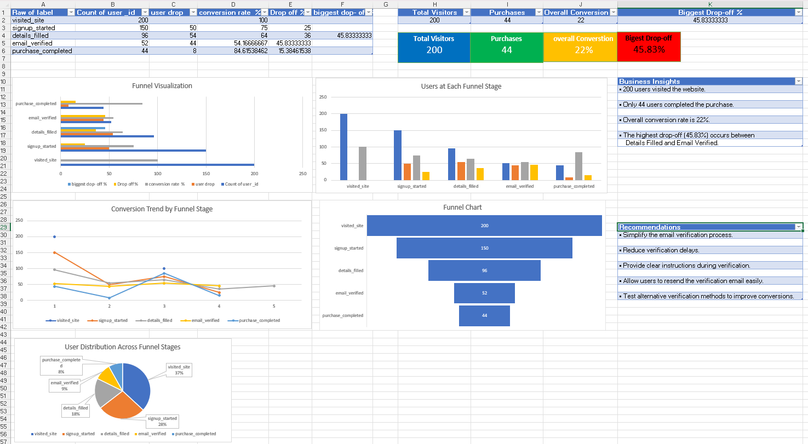
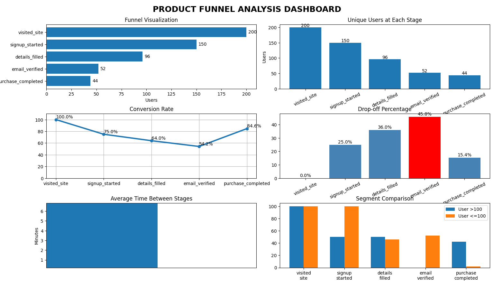
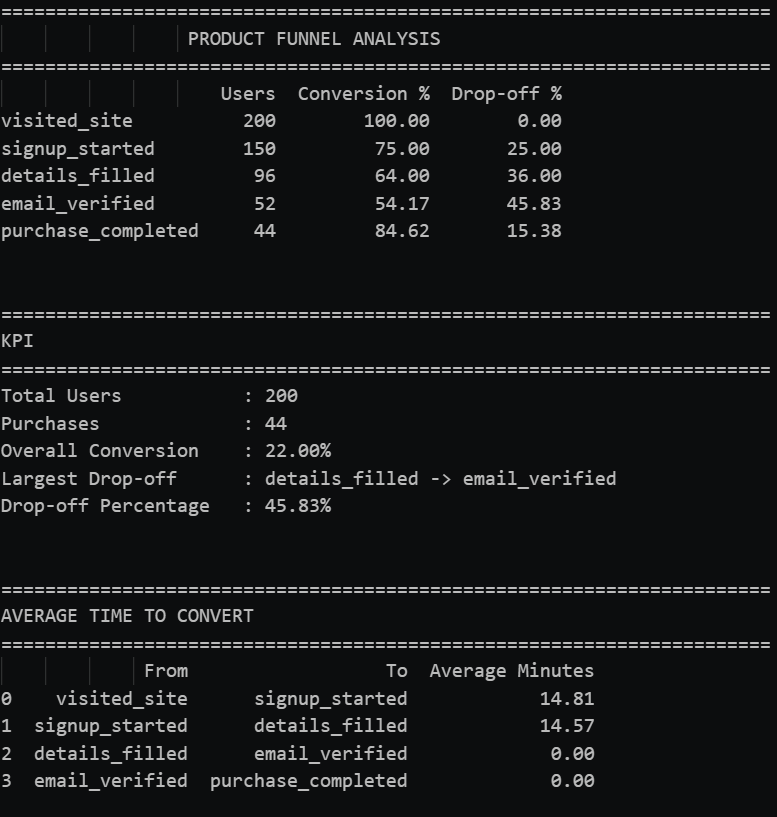
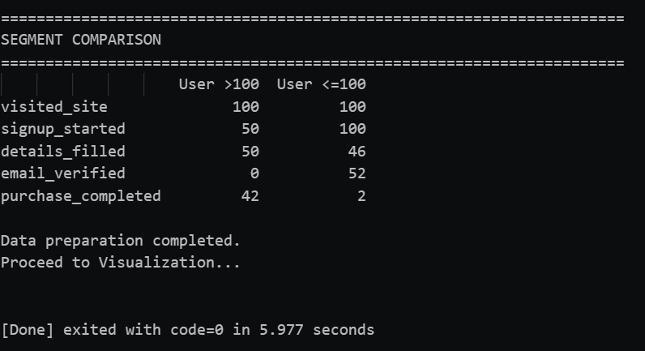

# Product Funnel Analysis Dashboard

## Project Overview

This project analyzes user behavior across a product signup and checkout funnel using Python and Microsoft Excel.

The objective is to identify where users leave the funnel, calculate conversion rates, analyze drop-off percentages, and present the findings using dashboards and visualizations.

---

## Funnel Stages

- Visited Site
- Signup Started
- Details Filled
- Email Verified
- Purchase Completed

---

## Features

- Data Cleaning
- Duplicate Event Removal
- Funnel Stage Ordering
- Unique User Count
- Conversion Rate Analysis
- Drop-off Analysis
- Largest Drop-off Detection
- KPI Calculation
- Time-to-Convert Analysis
- User Segment Comparison
- Interactive Excel Dashboard
- Python Visualization Dashboard

---

## Technologies Used

- Python
- Pandas
- NumPy
- Matplotlib
- Microsoft Excel
- Pivot Tables
- Charts & Dashboard

---

## Key Performance Indicators (KPIs)

- Total Users
- Completed Purchases
- Overall Conversion Rate
- Largest Funnel Drop-off

---

## Key Findings

- Total Users: **200**
- Purchases Completed: **44**
- Overall Conversion Rate: **22%**
- Largest Drop-off: **45.83%**
- Biggest Funnel Leak: **Details Filled → Email Verified**

---

## Business Recommendations

- Simplify the email verification process.
- Reduce verification delays.
- Provide clear verification instructions.
- Improve email delivery reliability.
- Test alternative verification methods to increase conversions.

---

## Project Structure

```
Product-Funnel-Analysis-Dashboard
│
├── data
│   └── funnel_events_sample.csv
│
├── excel_dashboard
│   └── Funnel_Analysis_Dashboard.xlsx
│
├── python
│   └── funnel_analysis.py
│
├── images
│   └── dashboard.png
│
└── README.md
```

---

## Dashboard Preview






---

## Skills Demonstrated

- Data Cleaning
- Data Analysis
- Product Analytics
- Funnel Analysis
- KPI Dashboard
- Excel Dashboarding
- Python Programming
- Data Visualization
- Business Intelligence